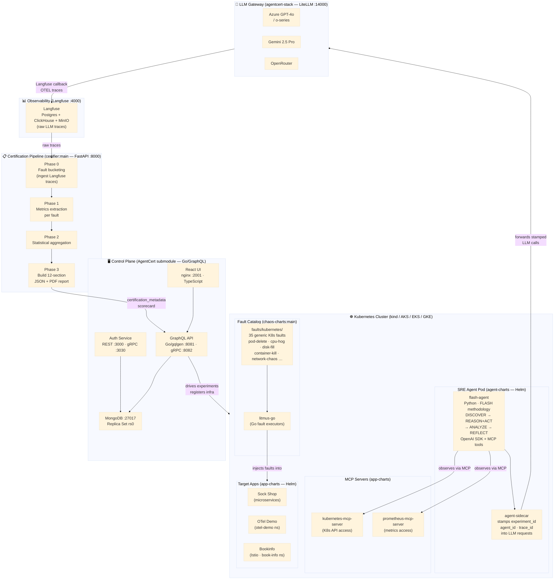
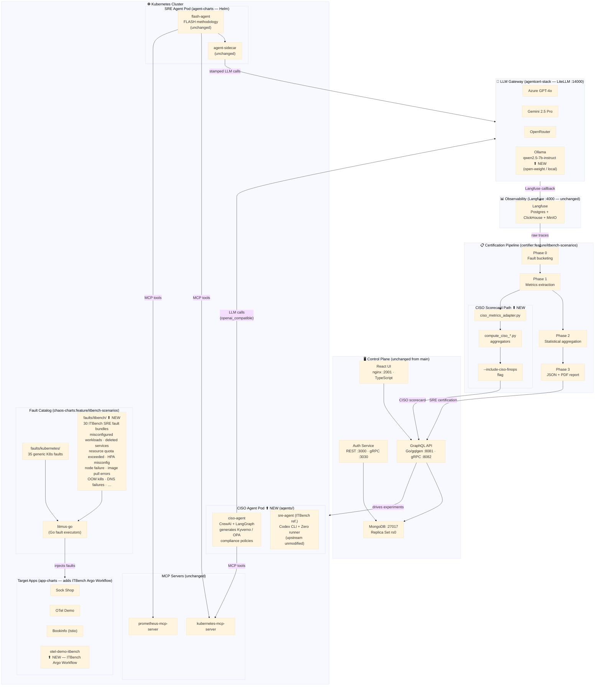
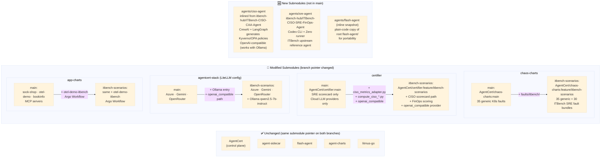
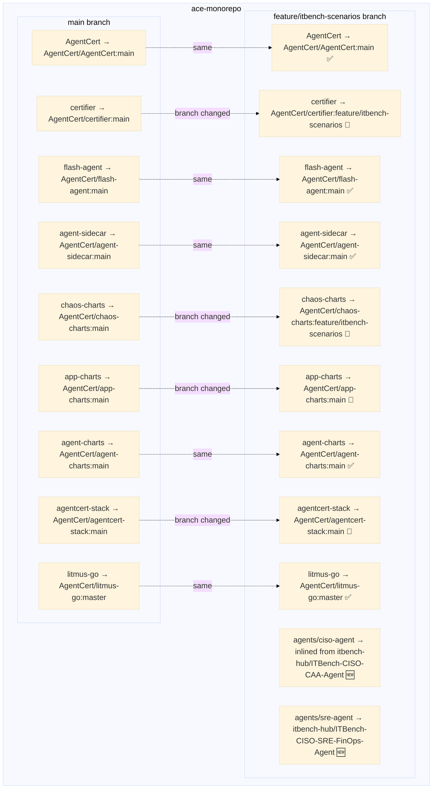

# ACE Monorepo — Architecture Diagrams

**Repo:** `AgentCert/ace-monorepo` · **Platform:** Agent Certification Engine (ACE)

---

## 1. `main` Branch — Full Architecture

---

## 2. `feature/itbench-scenarios` Branch — Full Architecture

---

## 3. Delta — What Changed Between Branches

---

## 4. Submodule Map — Both Branches Side-by-Side

---

## Legend

| Symbol | Meaning |
|--------|---------|
| ✅ | Unchanged between branches |
| 🔄 | Submodule pointer changed (different branch) |
| 🆕 | New — exists only on `feature/itbench-scenarios` |
| ⬆ NEW | Component added on `feature/itbench-scenarios` |
