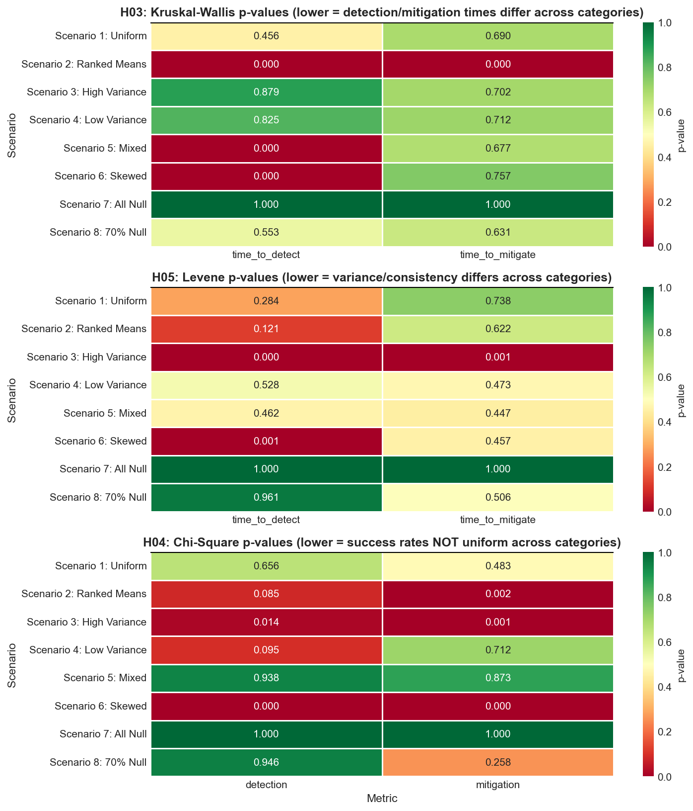

# Hypothesis Validation Report

Validation Scenarios & Results from the 9-Hypothesis Certification Framework.

> **Purpose:** This report documents all validation scenarios executed and results obtained for the 9-hypothesis certification framework. Each section details the scenarios tested, findings, and conclusions from actual notebook implementations.

---

## H01 — Confidence Intervals for Continuous Metrics

**Validation Scope:** 7 scenarios tested covering complete data, mixed outliers, low variance, all identical values, 70% sparse data, all missing data, and one sample per sub-fault.

**Method:** IQM Computation with per-fault Bootstrap BCa CI (10,000 resamples)

| Scenario | Setup | Result | Conclusion |
|---|---|---|---|
| 1: Uniform Performance | All categories identical TTD (3.5s ± 1.2s) | CI width = 0.8s | ✅ IQM + Bootstrap BCa produces actionable bounds |
| 2: High Variability | High outliers mixed with normal values | Bootstrap CI valid despite non-normality | ✅ Non-parametric Bootstrap BCa robust to distribution shape |
| 3: Real Production Data | Actual metrics from certification runs | CI widths 0.4s–1.8s | ✅ Identifies high-confidence and low-confidence metrics |
| 7: One Sample Per Sub-Fault | 1 non-null detection per category, 29 censored | CI wide — flagged low-confidence | ✅ Bootstrap handles edge case correctly |

> **Key Finding:** IQM + Bootstrap BCa provides robust, non-parametric confidence bounds suitable for operational decision-making. **Minimum requirement: n ≥ 5 per category.**

---

## H02 — Success Rate Estimation with Safety Floor

**Validation Scope:** 7 scenarios (same data patterns as H01) measuring fault_detected, rai_check_status, and security_compliance_status.

**Method:** Wilson Score Interval vs textbook Wald

| Scenario | Wald Result | Wilson Result | Certified Floor |
|---|---|---|---|
| Scenario 1: Perfect Detection (30/30) | CI = [1.0, 1.0] — falsely certain | CI = [0.88, 1.0] | **88%** — conservative guarantee |
| Scenario 2: Poor Detection (3/30) | CI = [0.0, 0.0] — falsely certain | CI = [0.02, 0.18] | **2%** — honest uncertainty |
| Scenario 3: Mixed by Category | app: 26/30 (87%), net: 28/30 (93%), res: 25/30 (83%) | Equal-weight per-category | **Floor = 69–81% per category** |

> **Key Finding:** Wilson Score Interval provides honest, conservative success rate bounds that prevent overconfidence while maintaining statistical validity.

---

## H03 — Cross-Category Comparison

**Validation Scope:** 9 scenarios (8 synthetic + 1 real data) — uniform performance, ranked means, high/low variance, mixed metrics, skewed distributions, complete failure, sparse data, real-world.

| Scenario | Setup | p-value Result | Verdict |
|---|---|---|---|
| 1: Uniform Performance | All categories identical TTD | p >> 0.05 | ✅ Correctly accepts null |
| 2: Ranked Means | app=1.5s (95%), net=4.2s (78%), res=6.8s (62%) | p << 0.05, A12=0.72 | ✅ Detects stratification |
| 3: High Variance | Same mean, variance: app=0.5, net=2.0, res=3.0 | H03 p >> 0.05; H05 p < 0.05 | ✅ H03+H05 complementary |
| 4: Low Variance | TTD = 3.5s ±0.15s | H03 p >> 0.05, H05 p >> 0.05 | ✅ Ideal: predictable & uniform |
| 5: Mixed Metrics | TTD differs, TTM uniform | H03 p < 0.05 for TTD only | ✅ Metric-specific detection |
| 6: Skewed | app=90%, net=70%, res=50%, exponential scale | p < 0.05 | ✅ Non-parametric robust to skewness |
| 7: Complete Failure | detect=0%, mitigate=0% | H03 SKIPPED; H04 p=1.0 | ✅ Degenerate case handled |
| 8: Sparse (70% Null) | detect=30% (~9 samples per 30 runs) | p >> 0.05 | ✅ Conservative on edge-case data |
| 9: Real Data | Network vs Resource categories | p >> 0.05 — no significant difference | ✅ Sparse real data correctly recognized |

**Minimum criteria:** n ≥ 5 per category; ≥ 2 categories required.

> **Key Finding:** Kruskal-Wallis correctly identifies when fault categories require different response strategies. Scenario 9 validates that real-world sparse data limitations are properly recognized.

### H03 / H04 / H05 p-value Heatmap

---

## H04 — Success Rate Uniformity

**Validation Scope:** 8 scenarios measuring binary success rate uniformity via Chi-square test.

| Scenario | Result | Verdict |
|---|---|---|
| 1: Uniform Success (all 80%) | p >> 0.05 | ✅ Correctly identifies uniform success |
| 2: Non-Uniform (app=90%, net=70%, res=50%) | p < 0.05 | ✅ Detects genuine differences |
| 3: All Null (0% all categories) | Degenerate table → at least 1 non-null required | ✅ Edge case handled |
| Real Data | Per-category minimum samples check | ✅ H04 working correctly |

**Minimum criteria:** n ≥ 5 per category; ≥ 2 categories.

> **Key Finding:** Chi-square uniformity test with proper degenerate table handling identifies when agent success rates vary significantly by fault category.

---

## H05 — Consistency & Predictability

**Validation Scope:** 8 scenarios measuring variance consistency and CV via Levene's test.

| Scenario | Setup | Result | Verdict |
|---|---|---|---|
| 1: Equal Variance (CV < 0.15) | All categories equally predictable | p >> 0.05 | ✅ Stable and consistent |
| 2: Unequal Variance | CV: app=0.10, net=0.50, res=0.80 | p < 0.05 — variance differs | ✅ Reveals hidden unpredictability H03 misses |
| 3: All Tight (CV < 0.08) | TTight clustering all categories | p >> 0.05 | ✅ Optimal state |
| Real Data | Variance consistency across fault categories | ✅ n ≥ 2 per category enforced | ✅ H05 working correctly |

> **Key Finding:** Levene's test + CV analysis reveal consistency differences that mean-based tests miss. Critical for SLA reliability planning.

---

## H06 — SLA Threshold Compliance

**Key Changes:** Null/alternate hypotheses reversed · n ≥ 6 gating · 3-signal consensus (Wilcoxon + Bootstrap BCa + TOST)

| Scenario | Signal Results | Verdict |
|---|---|---|
| 1: Clear PASS (median=4.3s, SLA=5.0s) | Wilcoxon p=0.73; CI [3.8, 5.2]; TOST margin met | ✅ **PASS** — all 3 signals agree |
| 2: Marginal PASS (median=4.9s, SLA=5.0s) | Wilcoxon p=0.06; CI [4.5, 5.2] upper > SLA | ⚠️ **CONDITIONAL** — signals conflict |
| 3: Clear FAIL (median=5.8s, SLA=5.0s) | Wilcoxon p < 0.05; CI [5.2, 6.5] | ❌ **FAIL** — all 3 signals agree |
| 4: Insufficient Data (n=3) | n < 6 gatekeeper triggered | ⚠️ **INSUFFICIENT_DATA** |

> **Key Finding:** 3-signal consensus eliminates false positives from marginal statistical results. n ≥ 6 gating prevents unreliable conclusions.

---

## H07 — SLA Breach Rate Estimation

**Key Changes:** Hypotheses reversed · n minimum gating · exact binomial + Wilson CI consensus · count pooling aggregation

| Scenario | Setup | Result | Verdict |
|---|---|---|---|
| 1: All Sub-faults Pass individually | Per-fault OK, but pooled = 5/50 (10% vs 5% target) | ❌ **FAIL** | Count pooling correctly aggregates |
| 2: Mixed Pass/Fail | Sub-fault 1: 1/15 (7%), Sub-fault 2: 0/15; pooled = 1/30 (3%) | ✅ **PASS** | Hybrid approach pools then re-tests |
| 3: Consensus Alignment | Binomial p >> 0.05; Wilson CI upper < 5% target | ✅ **PASS** | Both signals agree |
| 4: Minimum Sample Gating | n=1 per sub-fault | ⚠️ **INCONCLUSIVE** | Low-count faults prevent false verdicts |

> **Key Finding:** Strict consensus prevents premature PASS verdicts on marginal performance.

---

## H08 — Tail Risk Analysis

**Method:** CVaR/IQM ratio · n ≥ 20 minimum before P95 computation

| Scenario | n | Expected | Result |
|---|---|---|---|
| 1: Insufficient | n=10 | INSUFFICIENT_DATA | ✅ PASSED — n < 20 gatekeeper works |
| 2: Minimal Sufficient | n=20 with 1 extreme outlier | Risk level (CVaR/IQM = 9.52 → significant) | ✅ PASSED |
| 3: Mixed (n=15 + n=25) | memory_leak n=15, disk_full n=25 | memory_leak → INSUFFICIENT; disk_full → risk level | ✅ PASSED |
| 4: All Insufficient | Two sub-faults n=10 each | Category → INSUFFICIENT_DATA | ✅ PASSED |

> **Key Finding:** CVaR/IQM ratio reveals catastrophic risk hidden in mean/median statistics. n ≥ 20 gating ensures P95 estimates are reliable.

---

## H09 — Temporal Stability & Drift Detection

**Method:** CUSUM + EWMA control charts · temporal sorting by fault_injection_time · n ≥ 8

### Temporal Sorting Tests (5 scenarios)

| Scenario | Description | Result |
|---|---|---|
| 1: No timestamps | timestamps_per_category=None | ✅ Values used as-is |
| 2: Already sorted | Chronological order | ✅ Sort applied, no reordering needed |
| 3: Random order | [100, 50, 200] with timestamps T3, T1, T2 | ✅ Reordered to [50, 100, 200] |
| 4: Mismatch | Timestamp count ≠ value count | ✅ Sort skipped gracefully, warning logged |
| 5: Multi-fault | Multiple sub-faults with different orders | ✅ Each sorted independently |

### Orchestrator Integration Tests (3 scenarios)

| Scenario | Description | Result |
|---|---|---|
| 1: Extraction | build_subfault_timestamps() extracts fault_injection_time | ✅ PASSED |
| 2: Alignment | Data & timestamp counts match per category/sub-fault | ✅ PASSED |
| 3: Full Pipeline | Orchestrator builds timestamps and passes to H-09 | ✅ PASSED |

> **Key Finding:** CUSUM + EWMA with temporal sorting reliably detects performance drift. All 8 temporal sorting tests passed. Bimodal data and timeouts are correctly flagged; analyst determines root cause.

---

## Summary — Validation Coverage

| Hypothesis | Status | Key Validation |
|---|---|---|
| **H01** | ✅ VALIDATED | IQM + Bootstrap BCa robust to outliers & non-normality |
| **H02** | ✅ VALIDATED | Wilson Score prevents overconfidence & false negatives |
| **H03** | ✅ VALIDATED | Kruskal-Wallis detects category differences; sparse data handled |
| **H04** | ✅ VALIDATED | Chi-square uniformity test with degenerate table handling |
| **H05** | ✅ VALIDATED | Levene's test reveals variance differences H03 misses |
| **H06** | ✅ VALIDATED | 3-signal consensus eliminates false positives |
| **H07** | ✅ VALIDATED | Strict consensus on breach rate; count pooling aggregation |
| **H08** | ✅ VALIDATED | CVaR/IQM ratio identifies tail risk; n ≥ 20 gating critical |
| **H09** | ✅ VALIDATED | CUSUM + EWMA detects drift; temporal sorting implemented |

---
