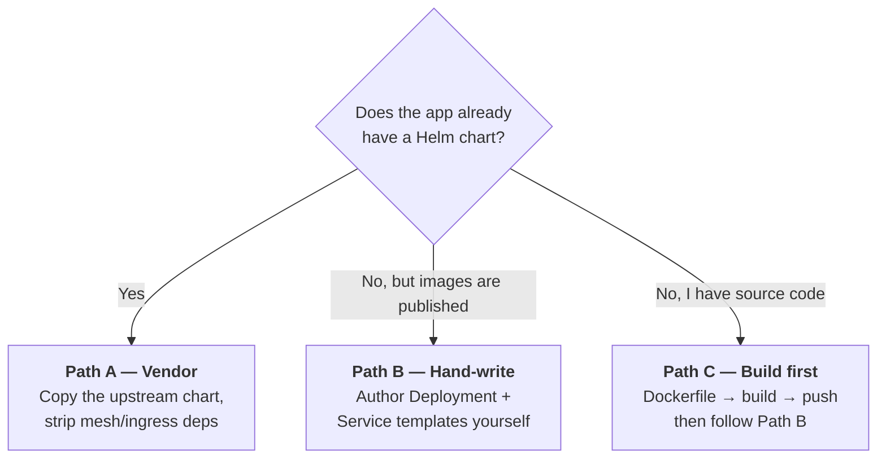

# Onboarding a Target Application

> How to add a new "system under test" (SUT) to the ACE platform — the application that
> faults are injected into and that AI agents are graded on diagnosing and repairing.

---

## 1. What an "application" is in ACE

An application is the **victim** in every certification run. The platform breaks it on
purpose, then measures whether the agent under test can detect and repair the damage.

Three applications ship today:

| App | Chart | Namespace | Label key | Origin |
|---|---|---|---|---|
| **Sock Shop** | `app-charts/charts/sock-shop` | `sock-shop` | `name` | Hand-written from Weaveworks manifests |
| **Bookinfo** | `app-charts/charts/bookinfo` | `book-info` | `app` | Vendored from `istio/istio` tag 1.30.2 |
| **OpenTelemetry Demo** | `app-charts/charts/otel-demo` | `otel-demo` | `opentelemetry.io/name` | Vendored from `opentelemetry-helm-charts` 0.40.9 |

Any application works — banking, e-commerce, an internal service. There is nothing
Sock-Shop-specific about the platform.

---

## 2. Where does the application's code come from?

**Not from this repository.** ACE charts only *reference* container images that already
exist in a registry.

```yaml
# app-charts/charts/sock-shop/templates/sock-shop/catalogue-deployment.yaml
containers:
  - image: {{ .Values.sockShop.catalogue.image }}
```

```yaml
# app-charts/charts/sock-shop/values.yaml
sockShop:
  catalogue:
    image: weaveworksdemos/catalogue:0.3.5   # pulled from Docker Hub at runtime
```

The Go/Java source code of Sock Shop is nowhere in this monorepo. The chart is a
**deployment descriptor**, not the application itself.

### Three ways to supply the images



| Path | When to use | Precedent in repo |
|---|---|---|
| **A — Vendor** | Upstream publishes a chart | `bookinfo`, `otel-demo` |
| **B — Hand-write** | Only public images exist | `sock-shop` |
| **C — Build first** | Your own proprietary app | — |

**Path C example:**

```bash
docker build -t myorg/banking-accounts:v1 ./accounts-service
docker push myorg/banking-accounts:v1

# Local dev clusters skip the registry entirely:
kind load docker-image myorg/banking-accounts:v1 --name agentcert
```

Then reference it from `values.yaml`:

```yaml
bankingApp:
  enabled: true
  accounts:
    replicas: 1
    image: myorg/banking-accounts:v1
```

A private registry additionally needs `imagePullSecrets` in the pod spec.

---

## 3. Chart anatomy — what must be inside

Copy `app-charts/charts/bookinfo/` as the starting point. It is the cleanest reference.

```
app-charts/charts/<my-app>/
├── Chart.yaml
├── values.yaml              # every toggle lives here — no values-<env>.yaml convention
└── templates/
    ├── namespaces.yaml      # <my-app>, litmus, monitoring
    ├── <my-app>/            # Deployments + Services for the app itself
    ├── monitoring/          # Prometheus, Grafana, metrics-server, kube-state-metrics
    ├── mcptools/            # kubernetes-mcp-server + prometheus-mcp-server
    ├── litmus/              # chaos-exporter (optional)
    └── chaos-experiments/   # pre-baked ChaosEngines (optional)
```

### Do not drop `mcptools/` or `monitoring/`

These are not optional extras — they are the agent's senses and hands.

| Directory | Why the run breaks without it |
|---|---|
| `mcptools/` | The agent reaches the cluster **only** through MCP servers. No MCP ⇒ the agent cannot list pods, read logs, or run PromQL. |
| `monitoring/` | No Prometheus ⇒ no alerts, no metrics, nothing for the agent to correlate against. |
| `loadGenerator` | No traffic ⇒ `HighRequestErrorRate` / `NoRequestsReceived` never fire, so an outage is invisible. |

| MCP server | Image | Exposure |
|---|---|---|
| `kubernetes-mcp-server` | `quay.io/containers/kubernetes_mcp_server:latest` | ClusterIP `:8081` |
| `prometheus-mcp-server` | `ghcr.io/pab1it0/prometheus-mcp-server:latest` | NodePort `31083` |

### `values.yaml` conventions

Every block is gated by an `enabled` flag:

```yaml
global:
  imagePullPolicy: IfNotPresent

namespaces:
  myApp: my-app
  litmus: litmus
  monitoring: monitoring

myApp:
  enabled: true
  accounts:
    replicas: 1
    image: myorg/banking-accounts:v1

  loadGenerator:
    enabled: true
    replicas: 1
    intervalSeconds: 5

monitoring:
  enabled: true

litmus:
  enabled: false        # LitmusChaos is installed separately by the platform
```

---

## 4. Requirements the app must satisfy

Beyond "the image runs", five properties decide whether the app is a usable chaos target.

### 4.1 Chaos annotation

```yaml
metadata:
  annotations:
    litmuschaos.io/chaos: "true"
```

### 4.2 A consistent label key across all services

`ChaosEngine` resolves its target via `spec.appinfo.applabel`. Pick **one** key and use
it everywhere:

```yaml
labels:
  app: sock-shop     # grouping label
  name: catalogue    # ← this key becomes APP_LABEL_KEYS['sock-shop'] = 'name'
```

### 4.3 Prometheus-scrapeable metrics

### 4.4 An in-cluster load generator

### 4.5 Image filesystem properties — the non-obvious one

> ⚠️ **This has already caused a real production bug in this repo.**
>
> `pod-io-stress` against `sock-shop/payment` enters the target container's **mount
> namespace** and writes files there. `payment` is a `FROM scratch` image with
> `readOnlyRootFilesystem: true`, so the injection died with a bare `exit status 1`
> **forty minutes into a run** — while
> `agents/FAULT_APPLICATION_COMPATIBILITY.md` still claimed every standard fault worked
> against every app.

Fault mechanisms and what they demand of your image:

| Mechanism | Needs from the target image | Safe on distroless / read-only? |
|---|---|---|
| `k8s-api` | Nothing — pure Kubernetes API mutation | ✅ Always |
| `helper-cgroup` | Nothing — enters PID namespace only | ✅ Yes |
| `helper-netns` | Nothing — enters network namespace only | ✅ Yes |
| `helper-mount-ns` | Binary present **inside** the image + a writable mount | ❌ No |
| `exec-in-target` | `/bin/sh` inside the image | ❌ No |
| `host-proc-write` | Writable rootfs via `/proc/<pid>/root/...` | ❌ No |
| `helper-node` / `node-ssh` | Node-level access (image irrelevant) | ✅ Yes |

The full classification lives in `chaos-charts/faults/fault-capabilities.yaml`.

**Rule of thumb:** a distroless or `FROM scratch` application is only compatible with
`mechanism: k8s-api` faults. Plan your fault set accordingly, or ship a debug-friendly
image variant for benchmarking.

---

## 5. Step-by-step procedure

### Step 1 — Create the chart

```bash
cd ace-monorepo/app-charts/charts
cp -r bookinfo my-app
# rename templates/bookinfo/ → templates/my-app/, update Chart.yaml name
```

### Step 2 — Fill in `values.yaml`

Namespaces, per-service image/replicas, `enabled` toggles, load generator.

### Step 3 — Register in the application catalog

`app-charts/charts/applications.chartserviceversion.yaml` → `spec.applications[]`:

```yaml
    - name: my-app
      displayName: My Banking App
      description: "Internal banking demo — accounts, ledger, payments, notifications."
      version: "1.0.0"
      namespace: my-app
      microservices:
        - name: accounts
          description: "Account management service"
        - name: ledger
          description: "Transaction ledger"
        # ... list every service
```

### Step 4 — Rebuild the installer image

The entire `charts/` tree is baked into the image at `/charts/`, so a new chart is
invisible until the image is rebuilt.

```bash
cd ace-monorepo/app-charts/install-app
make build-push
make list-charts        # verify my-app appears
```

The image is multi-stage: `golang:1.21` builder → `alpine:3.19` runtime with
Helm v3.14.0 + kubectl v1.29.0, running as non-root UID 1000.

### Step 5 — Update the UI compatibility maps

These are hardcoded in two files.

`AgentCert/chaoscenter/web/src/controllers/TargetApplicationTab/faultApplicationCompatibility.ts`:

```ts
export type CompatibleApp = 'otel-demo' | 'sock-shop' | 'book-info' | 'my-app';

export const APP_NAMESPACES: Record<CompatibleApp, string> = {
  // ...
  'my-app': 'my-app'
};

export const APP_SERVICES: Record<CompatibleApp, string[]> = {
  // ...
  'my-app': ['accounts', 'ledger', 'payments', 'notifications']
};
```

`AgentCert/chaoscenter/web/src/controllers/TargetApplicationTab/TargetApplicationTab.tsx`:

```ts
const APP_LABEL_KEYS: Record<CompatibleApp, string> = {
  // ...
  'my-app': 'name'          // the label key chosen in §4.2
};

const APP_FOLDERS: Record<CompatibleApp, string[]> = {
  // ...
  'my-app': ['my-app']      // chart folder name(s) / aliases
};
```

These maps narrow the App Kind / Namespace / Label pickers in Chaos Studio to values that
actually exist. Without them the pickers fall back to offering every live namespace
indiscriminately.

### Step 6 — Mirror into the compatibility document *(optional)*

`agents/FAULT_APPLICATION_COMPATIBILITY.md` is prose documentation. It is declared the
"authoritative source" that the `.ts` file mirrors, **but nothing enforces it and nothing
reads it at runtime.** Skipping it breaks nothing.

The CI-enforced catalog is `chaos-charts/faults/fault-capabilities.yaml` — see the fault
onboarding guide.

### Step 7 — Create a repeatable benchmark workflow

Copy `chaos-charts/experiments/bookinfo-itbench/experiment.yaml` →
`chaos-charts/experiments/my-app-itbench/experiment.yaml`.

```yaml
spec:
  entrypoint: argowf-chaos
  onExit: uninstall-all
  arguments:
    parameters:
      - name: appNamespace
        value: "my-app"
      - name: agentFolder
        value: "flash-agent"
      - name: faultDuration
        value: "300"

  templates:
    - name: argowf-chaos
      steps:
        - - name: install-application
        - - name: install-agent
        - - name: install-chaos-experiments
        - - name: scenario-36-invalid-selector
        - - name: scenario-53-nonexistent-pvc

    - name: install-application
      container:
        image: agentcert/agentcert-install-app:latest
        args:
          - "-folder=my-app"
          - "-namespace=my-app"
          - "-create-namespace"
          - "-wait"
          - "-timeout={{workflow.parameters.installTimeout}}"
```

**Is this step mandatory?** No — you can compose experiments by hand in the ChaosCenter
UI. But then every run is manual and not version-controlled.

| | Manual UI composition | Argo workflow |
|---|---|---|
| Repeatable | ❌ rebuild each time | ✅ one command |
| Version controlled | ❌ | ✅ in git |
| Multi-fault sequencing | manual | ✅ parallel / sequential built in |
| Comparable certifier traces | ad-hoc | ✅ consistent across runs |

---

## 6. Installing and verifying

### Direct Helm (development)

```bash
helm upgrade --install my-app app-charts/charts/my-app \
  --namespace my-app --create-namespace \
  --set monitoring.enabled=true
```

### Via the installer image (what the platform does)

```bash
docker run --rm \
  -v ~/.kube/config:/home/appuser/.kube/config:ro \
  agentcert/agentcert-install-app:latest \
  --folder my-app --namespace my-app --release my-app --wait
```

Installer flags: `--folder`, `--namespace`, `--release`, `--values`, `--set`, `--dry-run`,
`--wait`, `--timeout`, `--kubeconfig`, `--context`. It uses `kubectl rollout status`
rather than `helm --wait` to avoid Helm v3.14 rate-limiter issues.

### Verify

```bash
kubectl get deploy -n my-app \
  -o custom-columns=NAME:.metadata.name,DESIRED:.spec.replicas,READY:.status.readyReplicas

kubectl get svc -n my-app | grep mcp-server      # MCP servers must be up
kubectl get deploy -n monitoring                 # Prometheus + Grafana
```

---

## 7. Checklist

| # | Action | File / command |
|---|---|---|
| 1 | Images published or loaded into the cluster | `docker push` / `kind load docker-image` |
| 2 | Chart created from the bookinfo template | `app-charts/charts/<app>/` |
| 3 | `mcptools/`, `monitoring/`, load generator retained | `templates/` |
| 4 | Chaos annotation + consistent label key on every Deployment | `templates/<app>/` |
| 5 | Registered in the app catalog | `applications.chartserviceversion.yaml` |
| 6 | Installer image rebuilt and verified | `make build-push && make list-charts` |
| 7 | UI maps updated (3 constants) | `faultApplicationCompatibility.ts` |
| 8 | UI maps updated (2 constants) | `TargetApplicationTab.tsx` |
| 9 | Compatibility doc mirrored *(optional)* | `FAULT_APPLICATION_COMPATIBILITY.md` |
| 10 | Benchmark workflow authored *(for repeatable runs)* | `experiments/<app>-itbench/experiment.yaml` |

---

## 8. Common mistakes

| Mistake | Symptom |
|---|---|
| Chart added but installer image not rebuilt | `chart not found: /charts/my-app` |
| `mcptools/` omitted | Agent connects to nothing; every scan returns empty |
| No load generator | Fault injects successfully but no alert ever fires |
| Inconsistent label keys across services | ChaosEngine resolves zero targets; fault silently no-ops |
| Distroless image + `exec-in-target` fault | Bare `exit status 1` deep into a long run |
| UI maps not updated | App never appears in the Target Application picker |
