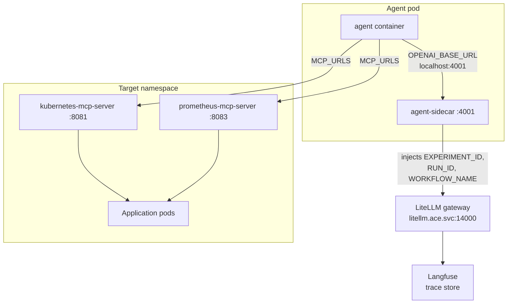
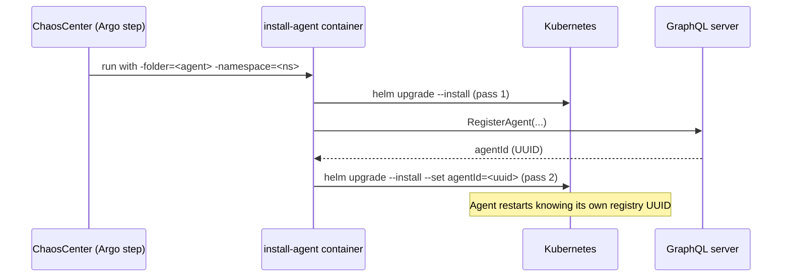

# Onboarding an AI Agent

> How to add a new AI agent to the ACE platform — the system under evaluation that must
> observe, diagnose, and remediate the faults injected into the target application.

---

## 1. What an "agent" is in ACE

The agent is the **subject** of certification. The platform deploys it next to a broken
application, gives it tools, and measures what it does.

Agents shipping today:

| Agent | Framework | Mode | Coverage |
|---|---|---|---|
| `flash-agent` | Custom ReAct + MCP | Live cluster | ITBench scenarios via Argo manifests |
| `k8s-agent` | Template (placeholder image) | Deployment or CronJob | Generic fault detection |
| `sre-agent` ("Zero") | Codex-CLI wrapper + MCP | Offline snapshot | ITBench-Lite dataset |
| `sre-agent-comprehensive` | Custom, 9-phase protocol | Live cluster | Broadest — ITBench + standard LitmusChaos |
| `sre-agent-crewai` | CrewAI + MCP streamable-HTTP | Live cluster | ITBench + standard, 30 runs/fault |
| `ciso-agent` | LangGraph + CrewAI | Live cluster | CIS compliance, not fault remediation |

Full descriptions: `agents/CAPABILITIES.md`.

---

## 2. Architecture — how an agent is wired in



Three integration surfaces:

| Surface | Purpose |
|---|---|
| **MCP servers** | The agent's only access to the cluster — pods, logs, events, deployments, PromQL |
| **LiteLLM gateway** | Single LLM entry point; model routing and cost accounting |
| **agent-sidecar** | Transparently injects experiment context into LLM calls so traces correlate back to the run |

### Why the sidecar exists

The agent has **zero awareness** of experiment context. It just talks to what it thinks is
an OpenAI endpoint on `localhost:4001`. The sidecar intercepts every request, stamps in
`EXPERIMENT_ID`, `EXPERIMENT_RUN_ID` and `WORKFLOW_NAME`, and forwards to LiteLLM.

This means **any** agent that can speak the OpenAI API becomes traceable without modifying
its source code.

```yaml
sidecar:
  enabled: true
  name: agent-sidecar
  image:
    registry: docker.io
    repository: agentcert/agent-sidecar
    tag: latest
  port: 4001
  upstream: "http://litellm.ace.svc.cluster.local:14000"
  injectionMode: "openai-metadata"    # openai-metadata | http-header | none
  resources:
    limits: { cpu: "100m", memory: "64Mi" }
```

---

## 3. Where the agent's code comes from

Same as applications: **a container image**, not this repository.

```yaml
agent:
  containerImage:
    registry: docker.io
    repository: agentcert/agentcert-flash-agent
    tag: latest
    pullPolicy: IfNotPresent
```

For your own agent:

```bash
docker build -t myorg/my-sre-agent:v1 ./my-agent
docker push myorg/my-sre-agent:v1
# or, for local clusters:
kind load docker-image myorg/my-sre-agent:v1 --name agentcert
```

### The contract your image must honour

Your agent reads its entire configuration from environment variables:

| Env var | Meaning | Source |
|---|---|---|
| `OPENAI_BASE_URL` | LLM endpoint (points at the sidecar when enabled) | ConfigMap |
| `OPENAI_API_KEY` | LLM key | Secret |
| `MODEL_ALIAS` | Model name routed by LiteLLM | ConfigMap |
| `MCP_URLS` | Comma-separated MCP server URLs | ConfigMap |
| `MCP_TIMEOUT` | Per-tool-call timeout, seconds | ConfigMap |
| `SCAN_INTERVAL` | `0` = run once, `>0` = continuous loop | ConfigMap |
| `AGENT_SCOPE_NAMESPACE` | Namespace the agent is allowed to operate in | ConfigMap |
| `AGENT_ID` | Registry UUID, injected on a second Helm pass | `--set` |

Anything that speaks the OpenAI API and the MCP protocol can be onboarded — language and
framework are irrelevant.

---

## 4. The two-pass install — why it exists



The agent receives its registry UUID **at runtime**, so every Langfuse trace it emits
correlates back to the registry record without an out-of-band lookup.

---

## 5. Chart anatomy

```
agent-charts/charts/<my-agent>/
├── Chart.yaml
├── values.yaml
└── templates/
    ├── deployment.yaml          # agent container + sidecar container
    ├── configmap.yaml           # non-secret config (OPENAI_BASE_URL, MCP_URLS, ...)
    ├── secret.yaml              # OPENAI_API_KEY
    ├── serviceaccount.yaml
    ├── clusterrole.yaml         # read access across the cluster
    ├── clusterrolebinding.yaml
    ├── role.yaml                # namespace-scoped write/remediation verbs
    └── rolebinding.yaml
```

### `values.yaml` skeleton

```yaml
agentId: ""          # injected on pass 2 of the install

agent:
  name: my-sre-agent
  version: "1.0.0"
  vendor: "MyOrg"
  id: ""
  role: "remediation"     # observer | remediation
  notifyId: ""            # experiment name → becomes Langfuse trace_id
  workflowUid: ""

  containerImage:
    registry: docker.io
    repository: myorg/my-sre-agent
    tag: v1
    pullPolicy: IfNotPresent

  config:
    OPENAI_BASE_URL: "http://litellm.ace.svc.cluster.local:14000/v1"
    MODEL_ALIAS: "gpt-4o"
    MCP_URLS: "http://kubernetes-mcp-server.my-app.svc.cluster.local:8081/mcp,http://prometheus-mcp-server.my-app.svc.cluster.local:8083/mcp"
    MCP_TIMEOUT: "30"
    SCAN_INTERVAL: "0"
    AGENT_SCOPE_NAMESPACE: "my-app"

  secret:
    OPENAI_API_KEY: "sk-agentcert-2026"

sidecar:
  enabled: true
  port: 4001
  upstream: "http://litellm.ace.svc.cluster.local:14000"
  injectionMode: "openai-metadata"

resources:
  limits:
    cpu: "500m"
    memory: "1.5Gi"     # LLM tool-call chains are memory hungry

rbac:
  cluster:
    create: true
    rules:
      - apiGroups: [""]
        resources: ["pods", "pods/log", "pods/status", "events"]
        verbs: ["get", "list", "watch"]
      - apiGroups: ["apps"]
        resources: ["deployments", "replicasets", "statefulsets"]
        verbs: ["get", "list", "watch"]
```

### Observer vs. remediation RBAC

| Role | Verbs | Use |
|---|---|---|
| `observer` | `get`, `list`, `watch` | Diagnosis-only benchmarks |
| `remediation` | + `patch`, `update`, `delete`, `scale` | Full detect-and-repair benchmarks |

Grant only what the benchmark requires. An observer agent with delete permissions can
accidentally "fix" a fault by deleting the workload.

---

## 6. Step-by-step procedure

### Step 1 — Build and publish the agent image

```bash
docker build -t myorg/my-sre-agent:v1 ./my-agent
docker push myorg/my-sre-agent:v1
```

### Step 2 — Create the Helm chart

```bash
cd ace-monorepo/agent-charts/charts
cp -r flash-agent my-sre-agent
# update Chart.yaml name, values.yaml image + config
```

### Step 3 — Register in the agent catalog

`agent-charts/charts/agents.chartserviceversion.yaml` → `spec.agents[]`:

```yaml
    - name: my-sre-agent
      displayName: My SRE Agent
      description: "Detects and remediates Kubernetes faults via MCP tooling."
      version: "1.0.0"
      capabilities:
        - fault-detection
        - auto-remediation
        - live-k8s
        - mcp
      installTemplateName: "install-agent"
      installImage: "agentcert/agentcert-install-agent:latest"
      contextInjection:
        - helmPath: "agent.config.EXPERIMENT_ID"
          source: "{{workflow.labels.workflow_id}}"
        - helmPath: "agent.config.EXPERIMENT_RUN_ID"
          source: "{{workflow.uid}}"
        - helmPath: "agent.config.WORKFLOW_NAME"
          source: "{{workflow.labels.subject}}"
```

`contextInjection` tells the GraphQL server which Helm paths to populate with workflow
context at experiment-save time. Copy the three entries verbatim — they are identical for
every agent.

### Step 4 — Rebuild the installer image

Charts are baked into the image at `/charts/`, so a new chart is invisible until rebuild.

```bash
cd ace-monorepo/agent-charts/install-agent
make build-push
```

Other targets: `make build`, `make tag NEW_TAG=v1.0.0`, `make kind-load`,
`make install FOLDER=my-sre-agent NAMESPACE=my-app`.

### Step 5 — Wire into a benchmark workflow

In `chaos-charts/experiments/<app>-itbench/experiment.yaml`:

```yaml
  arguments:
    parameters:
      - name: agentFolder
        value: "my-sre-agent"        # ← chart folder name

  templates:
    - name: install-agent
      container:
        image: agentcert/agentcert-install-agent:latest
        args:
          - "-folder={{workflow.parameters.agentFolder}}"
          - "-namespace={{workflow.parameters.appNamespace}}"
          - "-create-namespace"
          - "-timeout={{workflow.parameters.installTimeout}}"
          - "--set=agent.secret.OPENAI_API_KEY={{workflow.parameters.openaiApiKey}}"
          - "--set=agent.config.MODEL_ALIAS={{workflow.parameters.openaiModel}}"
          - "--set=agent.config.OPENAI_BASE_URL={{workflow.parameters.openaiBaseUrl}}"
          - "--set=agent.config.SCAN_INTERVAL={{workflow.parameters.scanInterval}}"
          - "--set=agent.notifyId={{workflow.name}}"
          - "--set=agent.workflowUid={{workflow.uid}}"
          - "--set=sidecar.upstream={{workflow.parameters.litellmUpstream}}"
```

> **Note:** the installer escapes `:` and `,` inside `--set` values, because Helm treats
> them as nested-key and key-value separators. URLs pass through safely.

### Step 6 — Add the offline benchmark harness *(optional)*

Required only to run `python scripts/ace-bench.py <agent-name>`. Three files under
`agents/harness/<agent-name>/`:

**`setup.sh`** — idempotent dependency install:

```bash
#!/usr/bin/env bash
set -euo pipefail
AGENT_DIR="$(cd "$(dirname "$0")/../../my-sre-agent" && pwd)"
python3 -m venv "${AGENT_DIR}/.venv"
"${AGENT_DIR}/.venv/bin/pip" install -r "${AGENT_DIR}/requirements.txt"
```

**`agent-harness.yaml`** — one agent invocation:

```yaml
path_to_data_provided_by_scenario: /tmp/agent/scenario_data.json
path_to_data_pushed_to_scenario:   /tmp/agent/agent_data.tar
run:
  command: ["/bin/bash"]
  args:
    - -c
    - |
      # invoke the agent, then tar its artefacts to the output path
```

**Harness contract:**

| Direction | Path |
|---|---|
| Input — scenario description | `/tmp/agent/scenario_data.json` |
| Output — all artefacts | `/tmp/agent/agent_data.tar` |

**`bench.yaml`** — scenario list and `runs_per_fault`.

### Step 7 — Document capabilities

Add a row and a section to `agents/CAPABILITIES.md`: framework, pipeline, and which
fault universe the agent is benchmarked against.

---

## 7. Deploying and verifying

```bash
helm upgrade --install my-sre-agent agent-charts/charts/my-sre-agent \
  --namespace my-app --create-namespace \
  --set agent.config.AGENT_SCOPE_NAMESPACE=my-app
```

```bash
kubectl get pods -n my-app -l app=my-sre-agent
kubectl logs -n my-app -l app=my-sre-agent -c agent --tail=50
kubectl logs -n my-app -l app=my-sre-agent -c agent-sidecar --tail=20
```

Confirm in order:

1. Agent pod is `Running` with **2/2** containers (agent + sidecar)
2. Agent logs show successful MCP connection — not timeouts
3. Sidecar logs show requests forwarded to LiteLLM
4. Langfuse shows traces tagged with the experiment ID

---

## 8. Checklist

| # | Action | File / command |
|---|---|---|
| 1 | Agent image built and published | `docker push` / `kind load docker-image` |
| 2 | Image reads config from the standard env vars | agent source |
| 3 | Helm chart created from the flash-agent template | `agent-charts/charts/<agent>/` |
| 4 | Sidecar block present and enabled | `values.yaml` |
| 5 | RBAC scoped to observer or remediation | `templates/clusterrole.yaml`, `role.yaml` |
| 6 | Registered in the agent catalog with `contextInjection` | `agents.chartserviceversion.yaml` |
| 7 | Installer image rebuilt | `make build-push` |
| 8 | `agentFolder` wired into the workflow | `experiments/<app>-itbench/experiment.yaml` |
| 9 | Harness added *(only for `ace-bench.py`)* | `agents/harness/<agent>/` |
| 10 | Capabilities documented | `agents/CAPABILITIES.md` |

---

## 9. Common mistakes

| Mistake | Symptom |
|---|---|
| Chart added but installer image not rebuilt | `chart not found: /charts/my-sre-agent` |
| `MCP_URLS` points at the wrong namespace | Agent starts, every scan returns empty |
| Sidecar disabled | Agent runs, but no trace correlates to the experiment |
| Agent reads `OPENAI_BASE_URL` from its own config instead of env | Sidecar bypassed; context injection silently lost |
| Observer agent granted `delete` | Agent "fixes" faults by deleting workloads — scores are meaningless |
| Memory limit left at 512Mi | OOMKilled mid tool-call chain; use 1.5Gi |
| `SCAN_INTERVAL` left at `0` for a continuous benchmark | Agent runs once and exits before the fault is injected |
