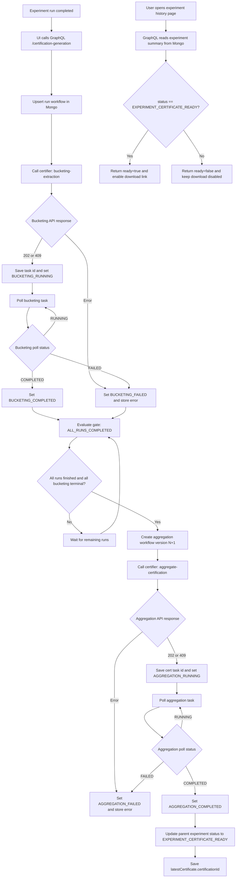

# Mongo Collection Architecture for Poller-Based Certificate Workflow

## 1. Purpose
This document defines the MongoDB data model for LitmusChaos certificate generation using a server-side poller orchestration pattern.

Design goals:
- Support one experiment with multiple runs.
- Keep UI decoupled from certifier APIs.
- Keep MongoDB as the single source of truth.
- Ensure deterministic transitions and idempotent orchestration.

## 2. Core Modeling Decision
Do not model certificate workflow as one document per experiment only.

Use a two-tier model:
1. Run-level workflow records for bucketing lifecycle per run.
2. Experiment-level aggregation/certificate records across runs.

This prevents overwrites when runs execute in parallel.

## 3. Collections

### 3.1 certificate_experiments (parent summary)
One document per project+experiment.

```json
{
  "_id": "ObjectId",
  "projectId": "proj-1",
  "agentId": "flash-agent",
  "agentName": "Flash Agent v1.0",
  "experimentId": "exp-123",
  "status": "RUNS_IN_PROGRESS",
  "expectedRuns": 30,
  "runCounts": {
    "total": 12,
    "running": 2,
    "completed": 9,
    "failed": 1
  },
  "aggregationPolicy": {
    "mode": "ALL_RUNS_COMPLETED"
  },
  "activeAggregationVersion": 2,
  "latestCertificate": {
    "status": "EXPERIMENT_CERTIFICATE_READY",
    "certificationId": "d290f1ee-6c54-4b01-90e6-d701748f0851",
    "pdfStatus": "NOT_FETCHED",
    "generatedAt": "2026-04-27T11:00:00Z"
  },
  "createdAt": "2026-04-27T09:00:00Z",
  "updatedAt": "2026-04-27T11:00:00Z"
}
```

Indexes:
- Unique: `{ projectId: 1, experimentId: 1 }`
- Non-unique: `{ projectId: 1, agentId: 1, status: 1 }`
- Non-unique: `{ status: 1, updatedAt: -1 }`
- Non-unique: `{ "latestCertificate.status": 1, updatedAt: -1 }`

### 3.2 certificate_run_workflows (run-level state)
One document per experiment run.

```json
{
  "_id": "ObjectId",
  "projectId": "proj-1",
  "agentId": "flash-agent",
  "experimentId": "exp-123",
  "experimentRunId": "run-0268",
  "runSequence": 7,
  "status": "BUCKETING_RUNNING",
  "bucketing": {
    "taskId": "1546dfab-0e7b-4879-9c30-61654f32a2b6",
    "pollUrl": "/api/v1/tasks?experiment_id=exp-123&experiment_run_id=run-0268",
    "lastPolledAt": "2026-04-27T10:10:00Z",
    "nextPollAt": "2026-04-27T10:10:15Z",
    "attempt": 4,
    "startedAt": "2026-04-27T10:00:05Z",
    "completedAt": null
  },
  "result": {
    "metricsReady": false,
    "metricsLocation": null
  },
  "error": {
    "code": null,
    "reason": null,
    "retryable": null,
    "lastFailedAt": null
  },
  "createdAt": "2026-04-27T10:00:00Z",
  "updatedAt": "2026-04-27T10:10:00Z",
  "version": 9
}
```

Indexes:
- Unique: `{ projectId: 1, agentId: 1, experimentId: 1, experimentRunId: 1 }`
- Unique sparse: `{ "bucketing.taskId": 1 }`
- Non-unique: `{ status: 1, "bucketing.nextPollAt": 1 }`
- Non-unique: `{ agentId: 1, experimentId: 1, status: 1 }`
- Non-unique: `{ updatedAt: -1 }`

### 3.3 certificate_aggregation_workflows (experiment-level aggregation/cert)
One document per aggregation version.

```json
{
  "_id": "ObjectId",
  "projectId": "proj-1",
  "agentId": "flash-agent",
  "agentName": "Flash Agent v1.0",
  "experimentId": "exp-123",
  "aggregationVersion": 2,
  "status": "AGGREGATION_RUNNING",
  "inputSnapshot": {
    "runIds": ["run-001", "run-002", "run-003"],
    "successfulRuns": 3,
    "failedRuns": 0
  },
  "aggregation": {
    "certTaskId": "agg-456",
    "pollUrl": "/api/v1/cert-tasks/agg-456",
    "lastPolledAt": "2026-04-27T10:30:00Z",
    "nextPollAt": "2026-04-27T10:30:20Z",
    "attempt": 3,
    "startedAt": "2026-04-27T10:20:05Z",
    "completedAt": null
  },
  "certificate": {
    "certificationId": null,
    "checksumSha256": null,
    "generatedAt": null,
    "expiresAt": null
  },
  "error": {
    "code": null,
    "reason": null,
    "retryable": null,
    "lastFailedAt": null
  },
  "createdAt": "2026-04-27T10:20:00Z",
  "updatedAt": "2026-04-27T10:30:00Z",
  "version": 6
}
```

Indexes:
- Unique: `{ projectId: 1, agentId: 1, experimentId: 1, aggregationVersion: 1 }`
- Unique sparse: `{ "aggregation.certTaskId": 1 }`
- Non-unique: `{ status: 1, "aggregation.nextPollAt": 1 }`
- Non-unique: `{ agentId: 1, experimentId: 1, createdAt: -1 }`

## 4. Status Models

### 4.1 Run Workflow Status
- `BUCKETING_INITIATED`
- `BUCKETING_TRIGGERED`
- `BUCKETING_RUNNING`
- `BUCKETING_FAILED`
- `BUCKETING_COMPLETED`

### 4.2 Aggregation Workflow Status
- `AGGREGATION_TRIGGERED`
- `AGGREGATION_RUNNING`
- `AGGREGATION_COMPLETED`
- `AGGREGATION_FAILED`

### 4.3 Experiment Summary Status
- `RUNS_IN_PROGRESS`
- `READY_FOR_AGGREGATION`
- `AGGREGATION_IN_PROGRESS`
- `EXPERIMENT_CERTIFICATE_READY`


## 5. Transition Rules

Run transitions:
- `BUCKETING_INITIATED -> BUCKETING_TRIGGERED`
- `BUCKETING_TRIGGERED -> BUCKETING_RUNNING`
- `BUCKETING_RUNNING -> BUCKETING_COMPLETED`
- `BUCKETING_RUNNING -> BUCKETING_FAILED`

Aggregation transitions:
- `AGGREGATION_TRIGGERED -> AGGREGATION_RUNNING`
- `AGGREGATION_RUNNING -> AGGREGATION_COMPLETED`
- `AGGREGATION_RUNNING -> AGGREGATION_FAILED`

Reject any invalid transition.

## 6. Trigger and Polling Logic

### 6.1 On Experiment Run Completion
1. Upsert into `certificate_run_workflows` by `(projectId, experimentId, experimentRunId)`.
2. If first time, set `status=BUCKETING_TRIGGERED`.
3. Call bucketing API once using `agent_id`, `experiment_id`, and `run_id` from the workflow doc.
4. Save `bucketing.taskId`, `bucketing.pollUrl`, set `status=BUCKETING_RUNNING`.

### 6.2 Bucketing Poller
Poll query target:
- `certificate_run_workflows` where `status=BUCKETING_RUNNING` and `bucketing.nextPollAt <= now`.

Result handling:
- `RUNNING`: update `lastPolledAt`, compute next poll.
- `FAILED`: set `status=BUCKETING_FAILED`, set error fields.
- `COMPLETED`: set `status=BUCKETING_COMPLETED`, `result.metricsReady=true`.

### 6.3 Aggregation Trigger Gate
Use `certificate_experiments.aggregationPolicy`:
- `ALL_RUNS_COMPLETED`

When gate passes:
1. Create new `certificate_aggregation_workflows` doc with next `aggregationVersion`.
2. Call aggregation API using `agent_id`, `agent_name`, and `experiment_id`, then set `AGGREGATION_TRIGGERED -> AGGREGATION_RUNNING` after API accept.
3. Update parent `certificate_experiments.status=AGGREGATION_IN_PROGRESS`.

Gate condition for `ALL_RUNS_COMPLETED`:
- all expected experiment runs are finished
- all corresponding bucketing workflows are in terminal state
- terminal bucketing states are `BUCKETING_COMPLETED` and `BUCKETING_FAILED`

This means aggregation starts only after the full experiment execution is over and no bucketing workflow is still pending or running.

### 6.4 Aggregation Poller
Poll query target:
- `certificate_aggregation_workflows` where `status=AGGREGATION_RUNNING` and `aggregation.nextPollAt <= now`.

Result handling:
- `RUNNING`: continue polling.
- `FAILED`: set `AGGREGATION_FAILED`, store error.
- `COMPLETED`: set `AGGREGATION_COMPLETED`, store `certificate.certificationId` and metadata.

Then update parent `certificate_experiments.latestCertificate` and set parent status to `EXPERIMENT_CERTIFICATE_READY`.

## 7. Idempotency and Concurrency

**Bucketing API Submission:**
1. Run init idempotency via unique key `(projectId, agentId, experimentId, experimentRunId)` — ensures workflow doc created once.
2. Before calling API: check if `bucketing.taskId` is already set. If yes, skip submission (already sent).
3. Call `POST /api/v1/bucketing-extraction` with `(agent_id, experiment_id, run_id)` from the workflow doc.
4. On 202 response: store returned `task_id`, set `status=BUCKETING_RUNNING`.
5. On 409 response (TASK_ALREADY_ACTIVE): the API already has this task. Extract `task_id` from response, store it, continue polling.
6. On other errors: set `status=BUCKETING_FAILED`, store error reason.

**Aggregation API Submission:**
Same pattern — use unique constraint `(projectId, agentId, experimentId, aggregationVersion)` and call `POST /api/v1/aggregation-certification` with `agent_id`, `agent_name`, and `experiment_id`.

**Concurrency for pollers:**
- For single-replica polling, no additional lock collection is required.

## 8. Retry and Backoff

Recommended defaults:
- Initial poll interval: 10-15 seconds.
- Backoff: 15s, 30s, 60s, 120s max.
- Max poll retries before failure: 20.
- API trigger retries (transient errors): 5.

Store retry metadata in each workflow doc.

## 9. Data Retention and Security

1. Never persist certifier secrets.
2. Redact sensitive payload fields before saving snapshots.
3. Keep workflow docs per compliance window (example: 180 days).
4. Use TTL for events if needed (example: 90 days).

## 10. UI Read Pattern

UI should query GraphQL only:
- Parent experiment certificate summary from `certificate_experiments`.
- Per-run progress from `certificate_run_workflows`.
- Latest `certificationId` from parent or latest aggregation doc.

PDF download should be done via a separate external API using `certificationId`.

UI should not call certifier APIs directly.

## 11. Why This Schema Works for Multi-Run Experiments

- Each run has isolated state and external task id.
- Experiment-level summary remains stable and query-friendly.
- Aggregation is versioned and repeatable when new runs arrive.
- Polling scales safely with indexes and lock support.
- Mongo remains the authoritative source for UI and backend orchestration.

## 12. API Flow Implementation

From UI to AgentCert GraphQL server:

1. After each experiment run completes, trigger a call to the GraphQL backend at `/certification-generation`.
2. The backend executes the certifier sequence in order:
  - `bucketing-extraction`
  - `poll-bucketing-extraction`
  - `aggregate-certification`
  - `poll-aggregate-certification`
3. Each step updates the MongoDB collections defined in this document.

Experiment history page behavior:

1. When the user opens experiment history, backend checks experiment summary status.
2. If status is `EXPERIMENT_CERTIFICATE_READY`, return a flag `true` to UI.
3. If status is not `EXPERIMENT_CERTIFICATE_READY`, return a flag `false`.
4. UI enables the download certificate link only when the flag is `true`; otherwise keep it disabled.

### 12.1 Flow Diagram



## 13. GraphQL to Certifier API Data Mapping

This section defines exactly how AgentCert GraphQL reads data from MongoDB, calls certifier APIs, and persists responses back to MongoDB.

### 13.1 Trigger: GraphQL `/certification-generation`

Inputs to GraphQL resolver (from UI/event):
- `projectId`
- `agentId`
- `experimentId`
- `experimentRunId`

GraphQL initial Mongo reads:
- `certificate_experiments` by `(projectId, experimentId)`
- `certificate_run_workflows` by `(projectId, agentId, experimentId, experimentRunId)`

If run doc does not exist, GraphQL upserts `certificate_run_workflows` with:
- `status=BUCKETING_INITIATED` then `BUCKETING_TRIGGERED`
- `agentId`, `experimentId`, `experimentRunId`
- `createdAt`, `updatedAt`

### 13.2 POST `/api/v1/bucketing-extraction`

Mongo source fields to build request payload:

| Request Field | Value Source |
|---|---|
| `agent_id` | `certificate_run_workflows.agentId` |
| `experiment_id` | `certificate_run_workflows.experimentId` |
| `run_id` | `certificate_run_workflows.experimentRunId` |
| `trace_source` | GraphQL config source (project/server settings or runtime input) |
| `llm_batch_size` | GraphQL config/default |
| `storage_config` | GraphQL config/default |

Response handling and Mongo updates:
- `202 Accepted`: save `bucketing.taskId`, `bucketing.pollUrl`, set `status=BUCKETING_RUNNING`, update `bucketing.startedAt`.
- `409 TASK_ALREADY_ACTIVE`: extract existing `task_id`, save it to `bucketing.taskId`, keep/set `status=BUCKETING_RUNNING`.
- `422/500/other error`: set `status=BUCKETING_FAILED`, store error payload in `error` fields.

### 13.3 GET `/api/v1/tasks`

GraphQL poll request mapping:

| Query Param | Value Source |
|---|---|
| `experiment_id` | `certificate_run_workflows.experimentId` |
| `experiment_run_id` | `certificate_run_workflows.experimentRunId` |

Poll selection in Mongo:
- `certificate_run_workflows` where `status=BUCKETING_RUNNING` and `bucketing.nextPollAt <= now`

Poll response to Mongo mapping:
- `RUNNING`: update `bucketing.lastPolledAt`, increment `bucketing.attempt`, compute and set `bucketing.nextPollAt`.
- `COMPLETED`: set `status=BUCKETING_COMPLETED`, set `bucketing.completedAt`, set `result.metricsReady=true`, optionally store metrics location metadata.
- `FAILED`: set `status=BUCKETING_FAILED`, set `error.code/reason/retryable/lastFailedAt`.

### 13.4 Aggregation Gate Evaluation

GraphQL reads Mongo before triggering aggregation:
- Parent: `certificate_experiments` by `(projectId, experimentId)`
- Runs: all `certificate_run_workflows` for `(agentId, experimentId)`

Gate condition (`ALL_RUNS_COMPLETED`):
- all expected runs are finished
- all run workflows are terminal (`BUCKETING_COMPLETED` or `BUCKETING_FAILED`)

If passed:
- create next `certificate_aggregation_workflows` with `aggregationVersion = activeAggregationVersion + 1`
- set aggregation status to `AGGREGATION_TRIGGERED`
- set parent `certificate_experiments.status=AGGREGATION_IN_PROGRESS`

### 13.5 POST `/api/v1/aggregation-certification`

Mongo source fields to build request payload:

| Request Field | Value Source |
|---|---|
| `agent_id` | `certificate_aggregation_workflows.agentId` |
| `agent_name` | `certificate_aggregation_workflows.agentName` |
| `experiment_id` | `certificate_aggregation_workflows.experimentId` |
| `certification_run_id` | derived by GraphQL (for example `v<aggregationVersion>` or release tag) |
| `runs_per_fault` | from `certificate_experiments.expectedRuns` or GraphQL config |
| `storage_config` | GraphQL config/default (`type=local`) |

Response handling and Mongo updates:
- `202 Accepted`: save `aggregation.certTaskId`, `aggregation.pollUrl`, set `status=AGGREGATION_RUNNING`, set `aggregation.startedAt`.
- `409 TASK_ALREADY_ACTIVE`: extract existing `cert_task_id`, save it, keep/set `status=AGGREGATION_RUNNING`.
- `400/422/500/other error`: set `status=AGGREGATION_FAILED`, store error payload.

### 13.6 GET `/api/v1/cert-tasks`

GraphQL poll request mapping:

| Query Param | Value Source |
|---|---|
| `experiment_id` | `certificate_aggregation_workflows.experimentId` |

Poll selection in Mongo:
- `certificate_aggregation_workflows` where `status=AGGREGATION_RUNNING` and `aggregation.nextPollAt <= now`

Poll response to Mongo mapping:
- `RUNNING`: update `aggregation.lastPolledAt`, increment `aggregation.attempt`, compute and set `aggregation.nextPollAt`.
- `COMPLETED`: set `status=AGGREGATION_COMPLETED`, set `aggregation.completedAt`, store `certificate.certificationId` from response `result.certification_id`, update checksums/metadata if available.
- `FAILED`: set `status=AGGREGATION_FAILED`, store normalized error fields.

Parent finalization after aggregation completion:
- update `certificate_experiments.activeAggregationVersion`
- set `certificate_experiments.status=EXPERIMENT_CERTIFICATE_READY`
- update `certificate_experiments.latestCertificate` with:
  - `status=EXPERIMENT_CERTIFICATE_READY`
  - `certificationId`
  - `generatedAt`
  - `pdfStatus=NOT_FETCHED`

### 13.7 Experiment History Read Path

GraphQL query for experiment history reads `certificate_experiments` and returns:
- `ready=true` if `status=EXPERIMENT_CERTIFICATE_READY`
- `ready=false` otherwise
- `certificationId` when available

UI behavior:
- if `ready=true`, enable certificate download link
- if `ready=false`, keep download link disabled

## 14. Certificate PDF Download

After aggregation completes successfully, the `certificationId` stored on
`certificate_experiments.latestCertificate.certificationId` is the handle
the certifier uses to serve the rendered PDF.  The PDF itself is **not**
stored in MongoDB — it is fetched on demand from the certifier service.

### 14.1 PDF Status Lifecycle

The `latestCertificate.pdfStatus` field tracks the local view of the PDF
artifact.  Allowed values:

| Status | Meaning |
|---|---|
| `NOT_FETCHED` | Certificate is ready but no one has requested the PDF yet (default after aggregation completes). |
| `FETCHING` | A download request is in flight to the certifier. |
| `FETCHED` | PDF has been streamed to the user at least once. |
| `FETCH_FAILED` | Last download attempt returned a non-2xx response. |

Transitions are written by the GraphQL PDF endpoint (section 14.3):
- `NOT_FETCHED -> FETCHING -> FETCHED`
- `NOT_FETCHED -> FETCHING -> FETCH_FAILED`
- `FETCH_FAILED -> FETCHING -> ...` (retry)

### 14.2 Certifier PDF Endpoint

```
GET {CERTIFIER_BASE_URL}/api/v1/certifications/{certification_id}/pdf
Accept: application/pdf
```

Response (200): `Content-Type: application/pdf`, body is the binary PDF.

Response (404): certification id not found or not yet ready.
Response (5xx): transient certifier error — eligible for retry.

### 14.3 GraphQL/REST Surface for the UI

The UI never calls the certifier directly.  The graphql-server exposes a
binary REST route that proxies the PDF and updates the status fields:

```
GET /api/certification/{projectId}/{experimentId}/certificate.pdf
Authorization: <session JWT>
```

Server behavior:
1. Read `certificate_experiments` by `(projectId, experimentId)`.
2. If `status != EXPERIMENT_CERTIFICATE_READY` or
   `latestCertificate.certificationId` is empty → return `409 Conflict`
   with body `{"error":"certificate not ready"}`.
3. Atomically `$set latestCertificate.pdfStatus="FETCHING"` and
   `latestCertificate.lastFetchAt = now()`.
4. `GET` the certifier PDF endpoint above with the stored
   `certificationId`.
5. On 2xx:
   - stream `Content-Type: application/pdf` directly to the HTTP client,
   - set `pdfStatus="FETCHED"` and increment `latestCertificate.fetchCount`.
6. On 4xx/5xx:
   - set `pdfStatus="FETCH_FAILED"` and write `latestCertificate.lastFetchError`,
   - return the upstream status code with a normalized JSON error body.

### 14.4 Mongo Field Additions on `latestCertificate`

```json
"latestCertificate": {
  "status": "EXPERIMENT_CERTIFICATE_READY",
  "certificationId": "d290f1ee-6c54-4b01-90e6-d701748f0851",
  "pdfStatus": "FETCHED",
  "generatedAt": "2026-04-27T11:00:00Z",
  "lastFetchAt": "2026-04-27T11:42:13Z",
  "lastFetchError": null,
  "fetchCount": 3
}
```

`lastFetchAt`, `lastFetchError`, and `fetchCount` are written only by
the PDF route described in 14.3.

### 14.5 UI Behavior for PDF Download

1. UI calls `getCertificationStatus`; if `ready=true` the download
   button is enabled.
2. Clicking the button issues a regular browser GET to
   `/api/certification/{projectId}/{experimentId}/certificate.pdf`.
3. The browser receives the binary stream and saves/opens it.
4. On error response, UI shows the normalized error message and keeps
   the button enabled for retry.

### 14.6 Idempotency, Caching, and Security

- The PDF endpoint is **idempotent** — the certifier produces the same
  PDF for a given `certificationId`.  Repeated downloads are safe.
- The graphql-server does **not** cache the PDF binary on disk; each
  request pulls fresh bytes from the certifier.  This avoids stale
  artifacts and keeps the server stateless.
- Authorization is enforced by the existing `Authorized` middleware
  (same JWT used elsewhere); only members of `projectId` may download.
- Audit: every PDF fetch increments `fetchCount` and updates
  `lastFetchAt`, providing a rudimentary access trail without storing
  PII.

### 14.7 Flow Diagram

```mermaid
flowchart LR
  U[User clicks Download] --> R[GET /api/certification/.../certificate.pdf]
  R --> M{status == EXPERIMENT_CERTIFICATE_READY?}
  M -->|No| E1[409 certificate not ready]
  M -->|Yes| S1[Set pdfStatus=FETCHING]
  S1 --> C[GET certifier /api/v1/certifications/{id}/pdf]
  C --> D{Upstream status}
  D -->|2xx| OK[Stream PDF to user, set pdfStatus=FETCHED, fetchCount++]
  D -->|4xx/5xx| F[Set pdfStatus=FETCH_FAILED, store lastFetchError]
  F --> ER[Return normalized error JSON]
```

---

## Certifier API Endpoint Configuration Locations

To connect AgentCert to the Certifier API and PDF service (local, Azure, or any remote deployment), set these two environment variables everywhere the orchestrator or PDF proxy runs:

- `CERTIFIER_BASE_URL` — main Certifier API endpoint (e.g. https://your-azure-certifier-host)
- `CERTIFICATE_PDF_BASE_URL` — PDF download endpoint (e.g. https://your-azure-certifier-host or https://your-azure-pdf-host)

### Where to set them

#### 1. Local/Scripted Startup (recommended for dev and most deployments)
- Edit your `.env` file at the repo root:
  - `CERTIFIER_BASE_URL=https://your-azure-certifier-host`
  - `CERTIFICATE_PDF_BASE_URL=https://your-azure-pdf-host`
- Pass this file to the startup script:
  ```bash
  bash scripts/azure_build/start-agentcert-v2.sh --env-file $(pwd)/.env --paths-file $(pwd)/build-paths.env
  ```

> **Note:**
> The only supported startup script for full stack bring-up is `start-agentcert-v2.sh`. If you see references to `start-agentcert.sh` in older docs or comments, use `start-agentcert-v2.sh` instead. Both required environment variables must be set in the `.env` file you provide to this script.

#### 2. Kubernetes Deployment (using provided manifests)
- Edit all three manifest files:
  - `AgentCert/chaoscenter/manifests/litmus-getting-started.yaml`
  - `AgentCert/chaoscenter/manifests/litmus-installation.yaml`
  - `AgentCert/chaoscenter/manifests/litmus-without-resources.yaml`
- In each, update both keys in the `ConfigMap` data block:
  ```yaml
  CERTIFIER_BASE_URL: "https://your-azure-certifier-host"
  CERTIFICATE_PDF_BASE_URL: "https://your-azure-pdf-host"
  ```

#### 3. Local GraphQL Server Direct Run (rare, for advanced dev only)
- Edit `AgentCert/chaoscenter/graphql/server/.env`:
  - `CERTIFIER_BASE_URL=https://your-azure-certifier-host`
  - `CERTIFICATE_PDF_BASE_URL=https://your-azure-pdf-host`

**Do NOT edit code defaults in `variables.go` — always override via env/config.**

### Reference: Where localhost:8088/8089 appear in the repo

- scripts/azure_build/start-agentcert-v2.sh: CERTIFIER_BASE_URL and CERTIFICATE_PDF_BASE_URL defaults
- .env.example: CERTIFIER_BASE_URL and CERTIFICATE_PDF_BASE_URL example values
- AgentCert/chaoscenter/graphql/server/utils/variables.go: Go config defaults
- AgentCert/chaoscenter/graphql/server/.env: local dev config
- AgentCert/chaoscenter/manifests/litmus-*.yaml: K8s ConfigMap values
- Docs/examples: AgentCert/docs/next-step.md, AgentCert/docs/new_requirement.md
